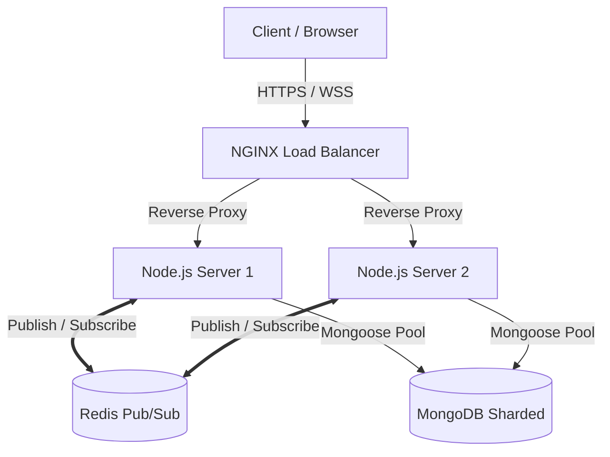

<div align="center">
  <h1>🚀 JS Real-time Chat Backend</h1>
  <p>A highly scalable, production-ready real-time chat application backend built with Node.js, WebSockets, and MongoDB.</p>
</div>

<br />

## 📖 Overview

**JS Real-time Chat** is a robust backend service designed to handle real-time messaging with high concurrent users. It focuses heavily on **System Design**, **Scalability**, and **Security**, solving common real-time communication bottlenecks like the "Split Brain" problem, Database Connection Exhaustion, and Race Conditions.

This project was built to demonstrate advanced backend capabilities, architecture patterns, and production deployment strategies typically required in large-scale applications.

## ✨ Key Features

- **⚡ Real-time Communication:** Built purely on WebSockets (`ws`) with custom Ping-Pong hearbeats to handle thousands of concurrent TCP connections efficiently.
- **🔐 Advanced Authentication:**
  - Secure JWT Authentication (Short-lived Access Tokens via Headers + Long-lived Refresh Tokens via `HttpOnly` Cookies).
  - Google OAuth2 Integration.
  - WebSocket Upgrade Handshake Interception for Token Verification.
- **🚀 Scalability Architecture (C10K+ Ready):**
  - **Redis Pub/Sub:** Solves the Split-Brain problem when scaling across multiple Node.js instances.
  - **Optimized MongoDB Queries:** Utilizing Compound Indexes (`channel_id`, `message_seq`) and Cursor Pagination (O(1)) instead of traditional Skip/Limit to prevent database bottlenecks.
  - Use of `.lean()` queries to strip Mongoose hydrations, saving up to 4x memory footprint.
- **🛡 Security First:**
  - Race-condition prevention using Atomic Increment (`$inc`) for message sequencing.
  - Payload Size Limits on WebSockets to prevent OOM (Out of Memory) DDoS attacks.
  - Granular Error Handling and Request Validation leveraging **Zod**.
- **🐳 DevOps & Deployment:** fully Dockerized with multi-container orchestration via `docker-compose`.

---

## 🏗 System Architecture

The architecture is designed to scale horizontally behind a Load Balancer / Reverse Proxy (NGINX), utilizing Redis for state synchronization across nodes.



---

## 🛠 Tech Stack

- **Runtime:** Node.js, Express.js
- **Database:** MongoDB (Mongoose ODM)
- **Real-time Engine:** WebSockets (`ws`)
- **Caching & Message Broker:** Redis
- **Security:** JSON Web Tokens (JWT), Bcrypt, Google Auth Library
- **Validation:** Zod
- **Infrastructure:** Docker, Docker Compose, NGINX

---

## 📂 Project Structure

```text
src/
├── config/         # Environment and Database configurations
├── controllers/    # API Request Handlers (Auth, Messages, Groups)
├── middlewares/    # Custom middlewares (Auth Guard, Error Handling)
├── models/         # Mongoose Schemas (User, Message, Group, Conversation)
├── routes/         # Express API Routes
├── services/       # Core Business Logic (Separation of Concerns)
├── utils/          # Helper functions and Custom Logger (Pino/Winston)
├── validators/     # Zod validation schemas
├── websockets/     # WebSocket Connection Manager & Handlers
└── server.js       # App Entry Point & Server Initialization
```

---

## 🚀 Getting Started

### Prerequisites
- Node.js (v18+)
- Docker & Docker Compose
- MongoDB (Local or Atlas)

### Local Development

1. **Clone the repository:**
   ```bash
   git clone https://github.com/your-username/js-real-time-chat.git
   cd js-real-time-chat
   ```

2. **Install dependencies:**
   ```bash
   npm install
   ```

3. **Configure Environment Variables:**
   Create a `.env` file in the root directory:
   ```env
   PORT=3000
   MONGO_URI=mongodb://localhost:27017/chatdb
   JWT_ACCESS_SECRET=your_access_secret
   JWT_REFRESH_SECRET=your_refresh_secret
   JWT_ACCESS_EXPIRES_IN=15m
   JWT_REFRESH_EXPIRES_IN=7d
   GOOGLE_CLIENT_ID=your_google_id
   ```

4. **Run with Docker Compose (Database + App):**
   ```bash
   docker-compose up -d
   ```
   *Alternatively, run the app directly:*
   ```bash
   npm run dev
   ```

5. **Health Check:**
   `GET http://localhost:3000/health` -> `{ "status": "ok" }`

---

<!-- ## 💡 Engineering Decisions & Trade-offs -->
<!---->
<!-- - **Why `ws` instead of `Socket.io`?**  -->
<!--   To deeply understand the WebSocket protocol, handle ping-pong heartbeats manually to detect "zombie" TCP connections, and optimize the transport layer payload size over standard JSON. -->
<!-- - **Cursor Pagination vs Skip/Limit:**  -->
<!--   Standard `skip()` requires scanning and discarding previous entries, resulting in O(N) complexity. By indexing `message_seq` and utilizing range queries (`$lt`), we achieve O(1) fetch performance for chat histories. -->
<!-- - **Why Redis?**  -->
<!--   In a single-instance Node.js app, keeping an In-Memory `Map` of users works. But to support C10K+ users, the app must run on multiple CPU cores / machines. Redis facilitates internal communication (Pub/Sub) between these detached instances. -->
<!---->
---

<div align="center">
  <i>Designed and developed to solve real-world system design challenges.</i>
</div>
